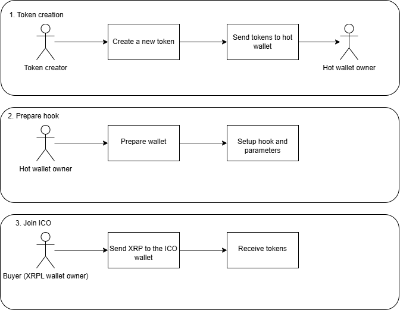

# XAHICO - Initial Coin Offering on XAHAU

## Description 

Xahico is a small project that uses Xahau Smart Contracts to turn any XRPL wallet into an ICO manager, where every time it receives a payment in XRP/XAH, it automatically sends the originator of the transaction a certain amount of corresponding tokens, similar to an Initial Coin Offering in other Blockchain networks.

## How works? 

The flow is as follows:

1. Create a new token on XRPL that you want to sell.
2. Send a certain amount of those tokens to a wallet that will be the manager of the Initial Coin Offering, for example, if you want to sell 10% of the total, only send 10% then.
- As a good practice, keep the wallet that creates the token separate from any transaction or process like an ICO, but if you are going to keep the whole process in the same wallet, skip this step.
3. Copy the .env.example file and rename it to .env.
4. Update the parameters in the .env file:
- _ICO_WALLET_SEED_: The seed of the wallet that will be the manager of the ICO (step 2).
- _ICO_CURRENCY_SYMBOL_: The symbol of the token you have created.
- _ICO_CURRENCY_ISSUER_: The token issuer (wallet from step 1 or 2 depending on your setup).
- _ICO_CURRENCY_RATIO_: The ratio for the sale. This ratio depends on the decimals of the tokens. For example, if you want to sell 1 token at 0.5 XRP/XAH, that is your ratio.
5. Run this code to deploy the hook on the wallet: 
```sh
yarn run deploy
```
6. Run a test from another wallet and send a certain amount of XRP and you should receive a certain amount of tokens.
- Remember that you must have a Trustline to successfully receive tokens from this account.




## Considerations/future improvements

- For now it only supports XRP as a currency and rejects any other type of payment, I will soon change that to be parametric.
- Instead of just payments, I will enable escrows, so that funds sent are blocked for a while.
- Automatically configure the Trustline on every transaction.